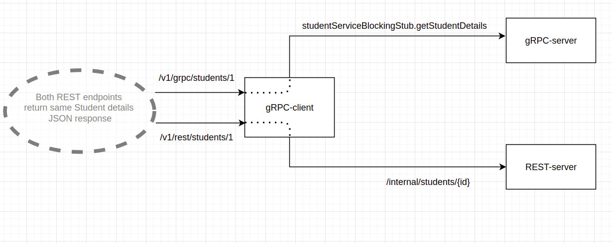
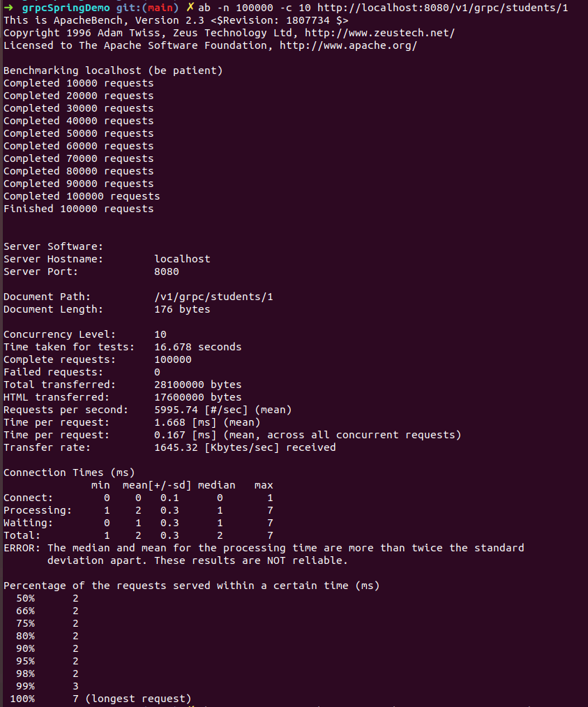
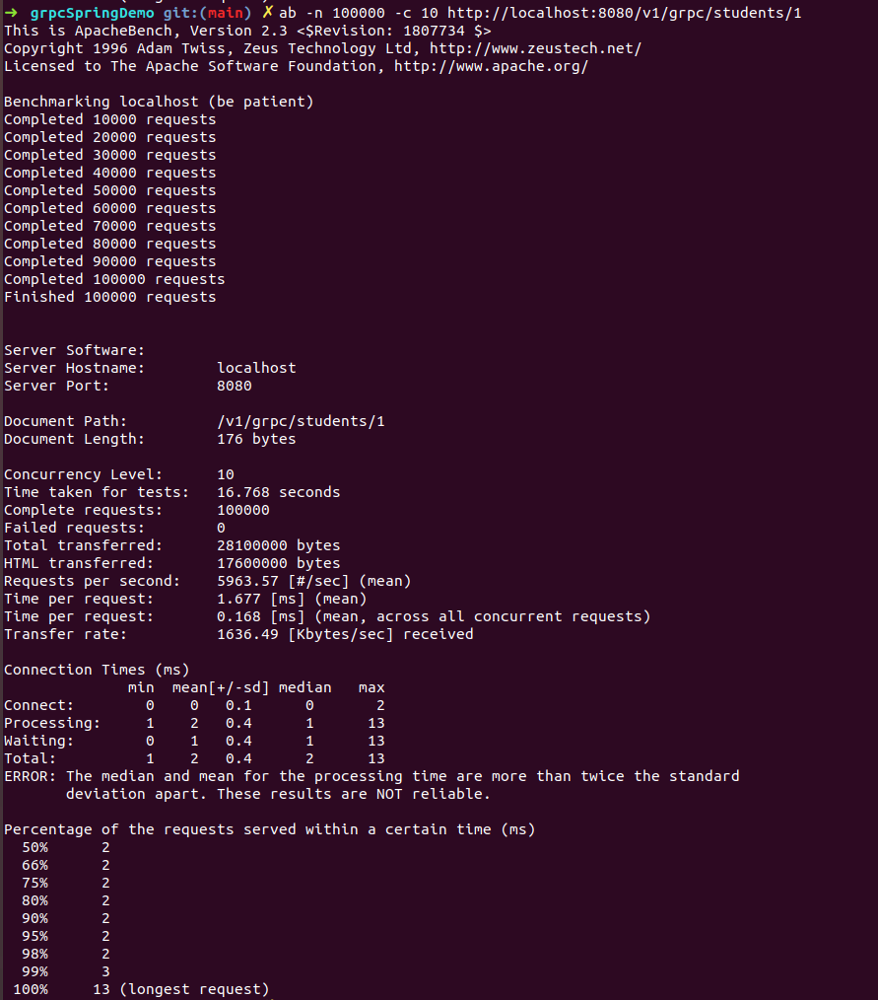
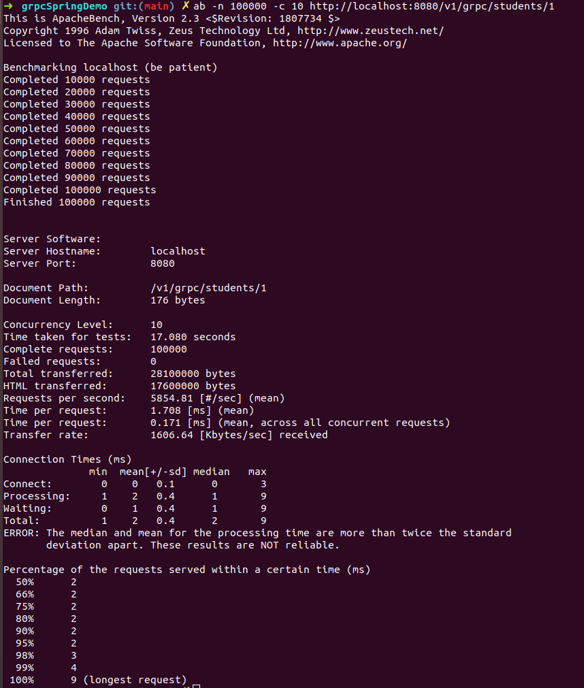
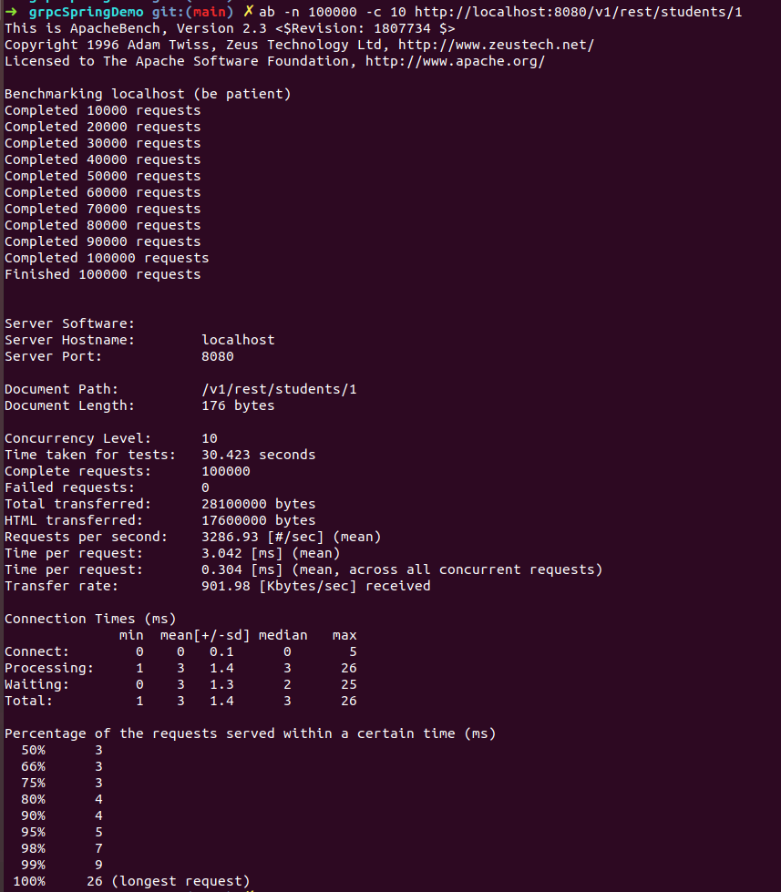
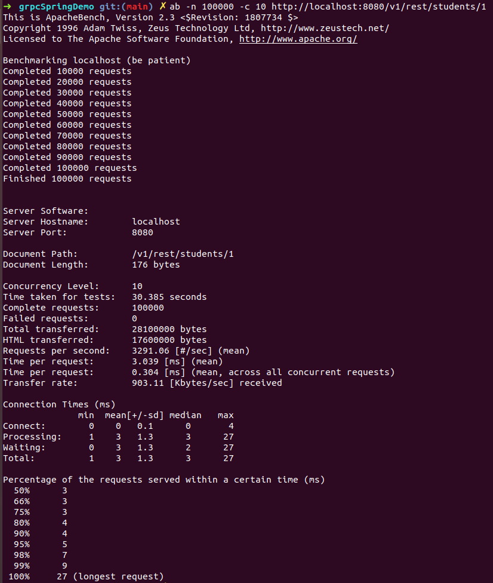
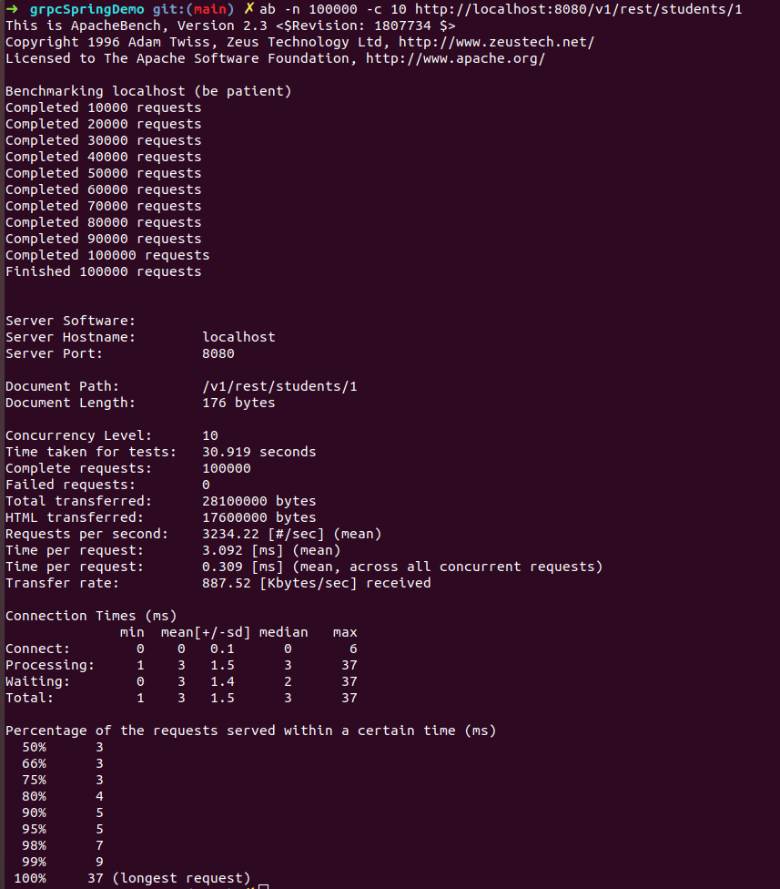

## Performance Comparison of REST vs gRPC



2 external facing endpoints exposed by gRPC client-

1. /v1/grpc/students/{studentId}
2. /v1/rest/students/{studentId}

1st endpoint internally has gRPC client which calls gRPC server to fetch Student details. Whereas the 2nd endpoint has a REST client which calls REST server to fetch Student details.

Both endpoints return the same response -> Details of Student Object

For example -

For Student Id : 1

JSON response for both endpoints -

```
{
  "name": "1",
  "id": "Rohan Gupta",
  "addressResource": {
    "addressLine1": "A-508 Embassy Golf Club",
    "addressLine2": "Marathahalli",
    "city": "Bengaluru",
    "country": "India",
    "pinCode": 560200
  }
}
```

JSON payload size: 172B

But for the gRPC payload size returned for the same Student object from gRPC-server is 81B.

### Performance Testing Benchmarking

We used ApacheBench for the benchmarking.

Load - 100k requests with concurrency of 10

1. gRPC

Results of 3 consequetive runs -

1st run



2nd run



3rd run



2. REST

Results of 3 consequetive runs -

1st run



2nd run



3rd run



### Conclusion


|                                                                         | **gRPC**         | **REST**        |
| ------------------------------------------------------------------------- | ------------------ | ----------------- |
| **Mean Time per request**                                               | ~1.68ms          | ~3ms            |
| **Avg Total Time taken for 100k request execution with concurrency 10** | ~16.8s           | ~30s            |
| **Avg Total requests per sec**                                          | ~5900            | ~3200           |
| **Avg Transfer rate**                                                   | ~1600 kBytes/sec | ~900 Kbytes/sec |
